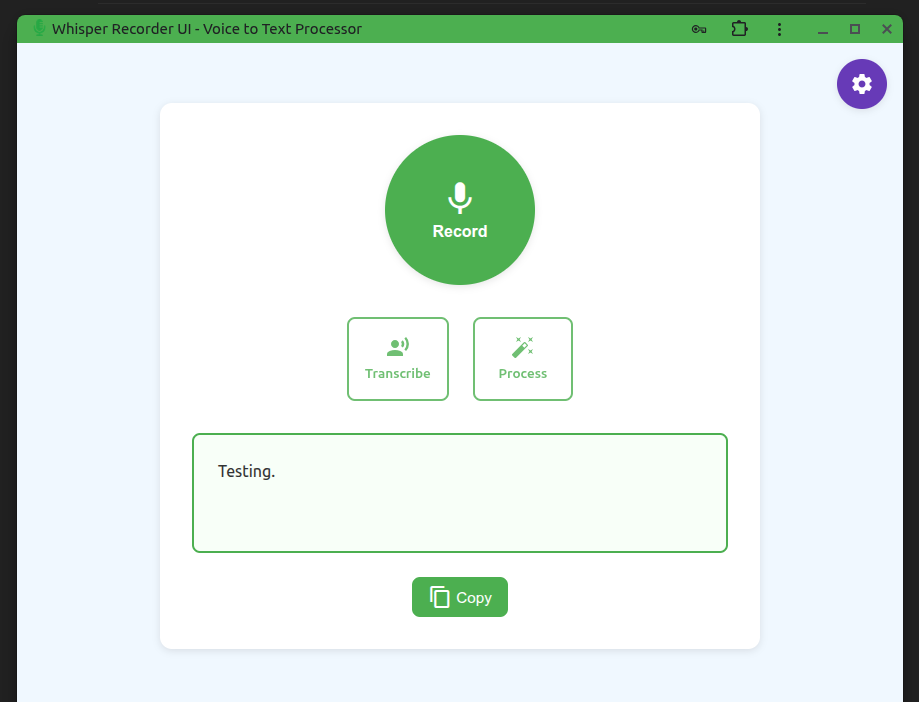

# Whisper Recorder UI v2

A streamlined Progressive Web App (PWA) for voice transcription that combines speech recognition with AI text formatting - now with enhanced mobile support and an improved user experience!



## What's New in v2

✨ **Streamlined Settings Interface**: New tabbed configuration panel with organized sections for Whisper, LLM, and system settings

🎯 **Quick Setup Presets**: One-click configuration presets for popular setups (Local, Groq Cloud, Hybrid)

📱 **Mobile-Optimized Design**: Responsive layout that works beautifully on phones, tablets, and desktops

🚀 **Progressive Web App (PWA)**: Install it like a native app on any device and use it offline

⚡ **Enhanced Performance**: Better layout management and optimized for all screen sizes

## Installation & Usage

### 🌐 **Use Online (Instant)**
Visit: **[https://humanface-tech.github.io/whisper-recorder-ui/](https://humanface-tech.github.io/whisper-recorder-ui/)**

### 📱 **Install as PWA (Recommended)**

**On Desktop (Chrome/Edge/Safari):**
1. Visit the web app URL
2. Look for the "Install" button in the address bar
3. Click "Install" to add it to your desktop
4. Launch from your desktop like any native app

**On Mobile (iOS/Android):**
1. Open the web app in your mobile browser
2. **iOS**: Tap the "Share" button → "Add to Home Screen"
3. **Android**: Tap the menu (⋮) → "Add to Home Screen" or "Install App"
4. The app will appear on your home screen

**On Desktop (Alternative):**
1. Click the browser menu (⋮)
2. Select "Install Whisper Recorder UI..."
3. Confirm installation

### 💾 **Download & Run Locally**
1. Download the repository files
2. Open `index.html` in any modern browser
3. No server required - runs entirely in your browser!

## How It Works

1. **🎤 Recording**: Captures high-quality audio directly from your browser using the Web Audio API
2. **🔤 Transcription**: Sends the audio to a Whisper ASR service (local or cloud-based) for speech-to-text conversion
3. **🤖 AI Processing**: Sends the raw transcription to an LLM for intelligent formatting, grammar fixes, and text refinement
4. **📋 Output**: Displays both raw transcription and processed text with one-click copy to clipboard

The entire app runs client-side with no backend dependencies, making it completely portable and privacy-friendly.

*For detailed technical background, read the [Voice to Code - Blog Article](https://nikro.me/articles/professional/whisper-voice-code/).*

## Quick Setup with Presets

v2 introduces **one-click configuration presets** for the most popular setups. Just click the ⚙️ settings icon and choose:

- **🏠 Local Setup**: Use locally running Whisper + Ollama services
- **☁️ Groq Cloud**: Full cloud setup with Groq's APIs (fastest to get started)
- **🔄 Hybrid**: Local Whisper + cloud LLM (best of both worlds)

## Detailed Setup Options

### Option 1: Local Setup (Self-hosted Services)

This configuration uses locally running instances of Whisper ASR and Ollama for LLM processing:

1. **Install and Run Local Whisper ASR Service**:

   ```bash
   # Using Docker
   docker pull onerahmet/openai-whisper-asr-webservice:latest
   docker run -d -p 9100:9000 onerahmet/openai-whisper-asr-webservice:latest
   ```

2. **Install and Run Ollama**:

   ```bash
   # Install Ollama (MacOS/Linux)
   curl -fsSL https://ollama.com/install.sh | sh
   
   # Pull a model
   ollama pull qwen2.5-coder:14b
   
   # Start Ollama service (it runs on port 11434 by default)
   ollama serve
   ```

3. **Configure the App**:
   - Whisper API Endpoint: `http://localhost:9100/asr`
   - Whisper API Format: `Local Whisper`
   - LLM Provider: `Ollama`
   - LLM Endpoint: `http://localhost:11434/api/generate`
   - LLM Model: `qwen2.5-coder:14b`

Alternatively - you can use this fork: [HumanFace-Tech/whisper-asr-with-ui](https://github.com/HumanFace-Tech/whisper-asr-with-ui)

### Option 2: Cloud-based Setup with Groq (No Local Services)

This configuration uses cloud services for both ASR and LLM processing:

1. **Sign Up for Groq**:
   - Create an account at [groq.com](https://groq.com)
   - Generate an API key from the dashboard
   - Note: Groq offers both LLM APIs as well as Whisper APIs through their OpenAI-compatible endpoints

2. **Configure the App for Groq**:
   - Whisper API Endpoint: `https://api.groq.com/openai/v1/audio/transcriptions`
   - Whisper API Format: `OpenAI/Groq Compatible`
   - Whisper API Key: `[Your Groq API Key]`
   - Whisper Model: `whisper-large-v3`
   - LLM Provider: `OpenAI-compatible`
   - LLM Endpoint: `https://api.groq.com/openai/v1/chat/completions`
   - LLM Model: `gemma2-9b-it` (from our tests - it works the best and is cost-effective)
   - API Key: `[Your Groq API Key]`

### Option 3: Hybrid Setup (Local Whisper + Cloud LLM)

This combines local Whisper ASR with a cloud LLM service like Groq:

1. **Install and Run Local Whisper ASR Service** (as in Option 1)

2. **Configure the App**:
   - Whisper API Endpoint: `http://localhost:9100/asr`
   - Whisper API Format: `Local Whisper`
   - LLM Provider: `OpenAI-compatible`
   - LLM Endpoint: `https://api.groq.com/openai/v1/chat/completions`
   - LLM Model: `gemma2-9b-it`
   - API Key: `[Your Groq API Key]`

### Enhanced API Resilience

`js/api.js` now uses `APIHelper` for robust handling of diverse providers:

- **Ollama Endpoints**: Set LLM endpoint to `/api/chat` (messages format) or `/api/generate` (prompt format) – auto-detected, no extra config.
- **Local Whisper Servers**: Supports varying field names (`audio_file` fallback to `file`). Works with Docker images like `onerahmet/openai-whisper-asr-webservice`.
- **Universal Responses**: Extracts text from OpenAI/Groq (`choices[0].message.content`), Ollama, or custom formats.

Just enter your endpoint/model – resilience handles the rest.

## Troubleshooting

- **Transcription fails**: Check that your Whisper service is running and accessible
- **API Connection Issues**: If connecting to external services, ensure your API key is valid and correctly entered
- **LLM processing fails**: Verify the model name exists and is spelled correctly
- **No audio recording**: Ensure your browser has microphone permissions
- **Cross-Origin Errors (CORS)**: This app runs entirely in the browser, which means direct calls to cloud APIs (like Groq, OpenAI) may be blocked by CORS policies:
  - **Test Connection may fail** for Whisper endpoints (OPTIONS preflight blocked) but work for LLM endpoints (`/models`)
  - **For production use with cloud APIs**, you'll need:
    - A CORS proxy (e.g., [cors-anywhere](https://github.com/Rob--W/cors-anywhere))
    - A browser extension that bypasses CORS
    - Or deploy with a backend proxy
  - **Local APIs (Ollama, Local Whisper) work fine** without CORS issues
  - See [MDN CORS Guide](https://developer.mozilla.org/en-US/docs/Web/HTTP/CORS) for more details

## Customizing the System Prompt

The default system prompt instructs the LLM how to format and clean up the transcribed text. You can customize this in the configuration panel to suit your specific needs:

- For more thorough corrections, emphasize grammar and spelling fixes
- For minimal interference, specify that the LLM should preserve the original wording
- For specialized formats (like code snippets), instruct the LLM to detect and format these elements properly

## Contributing

This tool is designed to be flexible and expandable. We welcome contributions to support additional ASR or LLM providers:

- **Supporting New LLM Providers**: Fork the repository and add handlers for new API formats
- **Improving Transcription**: Enhancements to audio processing or format conversion are welcome
- **UI Improvements**: Suggestions for better usability while maintaining the single-file approach

If you'd like to contribute or have suggestions, please feel free to fork the project or submit your ideas.

---

## About

🎯 **Vibe-coded with passion** at [**HumanFace Tech**](https://www.humanfacetech.com/about) - where we build tools that actually make sense and work the way you'd expect them to.

*Like this project? Check out what else we're building at HumanFace Tech!*

## License

This project is licensed under the MIT License.
